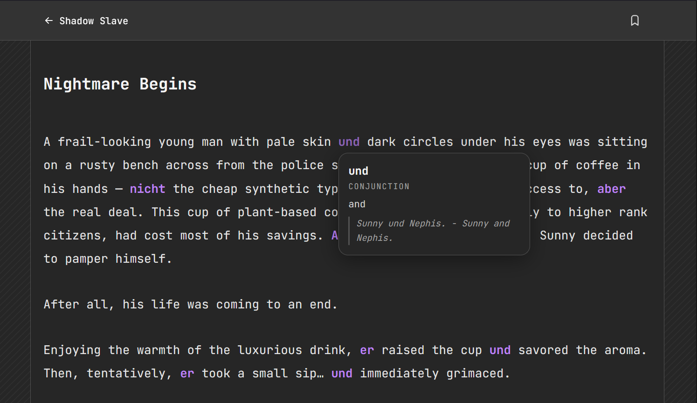

# Schatten Lesen

Read light novels. Learn German without noticing.

German words are woven directly into the English prose - highlighted inline. Hover or tap any coloured word to see its translation, grammar type, and an example sentence.

---

## The Idea

Traditional vocabulary study is boring and easy to skip. Schatten Lesen hides the learning inside something you actually want to read.

As chapters progress, common words appear more often and their popups get slimmer - by the time a word has shown up dozens of times, you probably don't need the example sentence anymore.

---

## Three Ways to Read

Every novel in the library uses one of three reading modes:

- **Annotated** - the default. Full English chapters with key German words swapped in and colour-coded inline, as described above. Toggle each word between **Annotate** (see the German word, tap to peek at the meaning) and **Reveal** (see the translation, tap to reveal the German) in Settings.
- **Parallel** - German and English side by side, paragraph by paragraph. Switch the language mode to **DE**, **EN**, or **Both** (tap a paragraph to flip it between languages one at a time, with a little animated "warp" transition).
- **Graded** - short, simplified German stories written for real learners (currently CEFR A1), followed by a **Vokabeln** list of tap-to-reveal glossary terms and an **Übung** quiz section with instant right/wrong feedback per question.

---

## What You'll See

In annotated and graded chapters, words are colour-coded by grammatical type:

| Colour | Type |
|--------|------|
| Yellow | Verbs |
| Blue | Nouns - *der* (masculine) |
| Pink | Nouns - *die* (feminine) |
| Green | Nouns - *das* (neuter) |
| Purple | Everything else (pronouns, adjectives, adverbs, conjunctions) |

Tap or hover any word to see:
- The German word
- Its grammatical label
- English translation
- An example sentence (for newer words)

Grammatical articles (*der/die/das/den/dem/des* and friends) are also colour-coded wherever they appear in tables, so noun gender stays visible even outside the annotation system.

---

## Bookmarking

Every reading mode supports a single, app-wide word bookmark:

1. Tap the bookmark icon in the header to arm "select mode" (cursor turns into a pencil).
2. Tap the word you want to remember - or, in parallel novels, tap the paragraph.
3. It's saved instantly and highlighted in amber wherever it appears.

Your bookmark shows up right on the home page under **Your Bookmark**, one tap away from picking up exactly where you left off. Tapping the already-bookmarked word/paragraph again clears it.

---

## Reading Settings

The settings panel (gear icon, top right of every chapter) covers:
- **Theme** - Light, Dark, or Auto (follows system)
- **Font size** - adjustable up/down
- **Font style** - Mono, Sans, or Serif
- **Brightness** - dims the screen for night reading
- **Word Display** - Annotate vs Reveal (annotated novels only)
- **Language** - DE / EN / Both (parallel novels only)

All settings and your reading progress are saved automatically in your browser. No account needed.

---

## Reading Progress

Your last-read chapter is tracked per novel automatically, so the library always knows where you left off. No account needed - everything lives in your browser.
